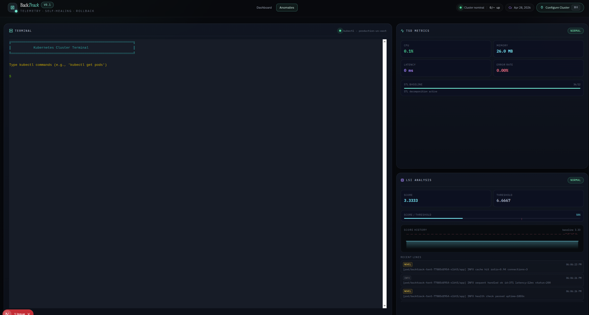
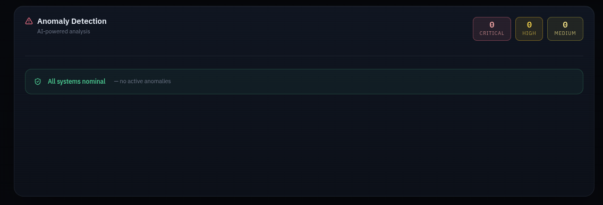
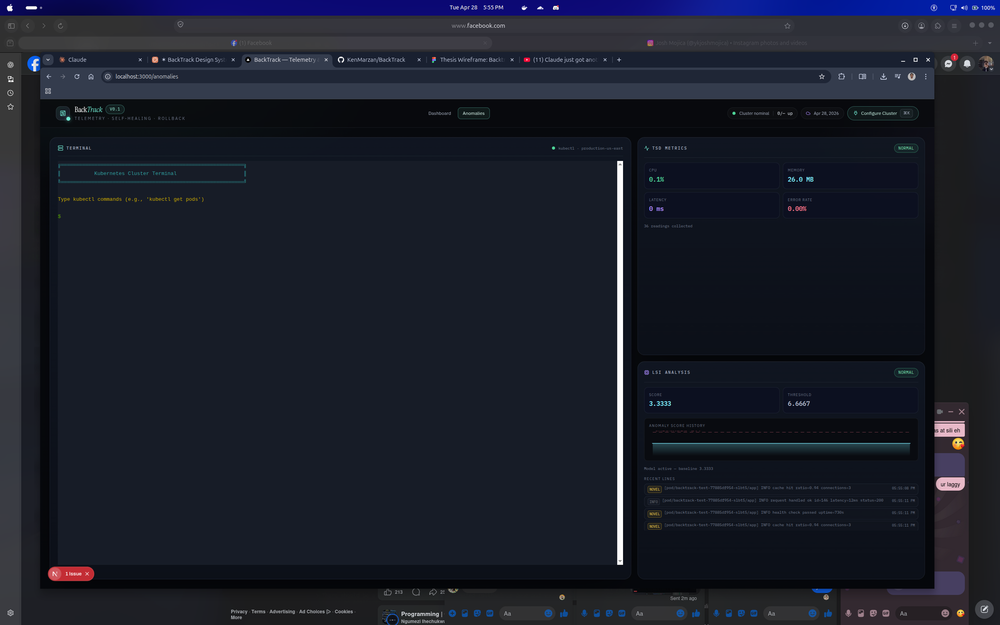
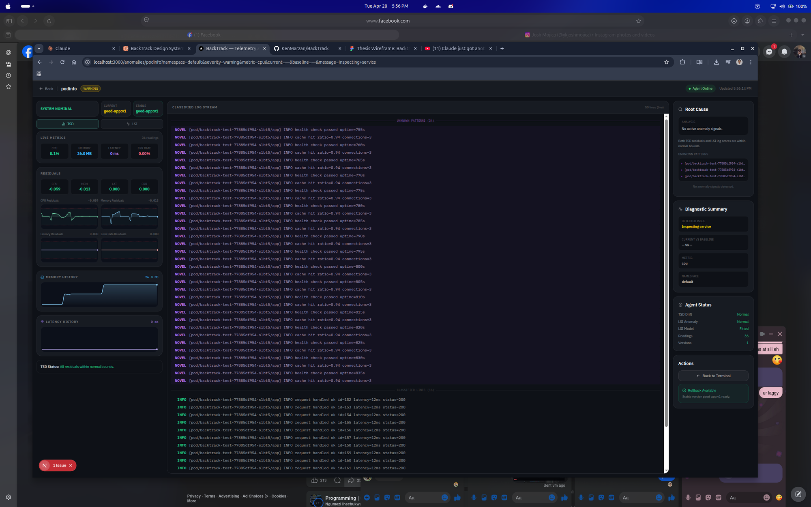

# BackTrack

**Local-first observability, anomaly detection, and self-healing rollback for Kubernetes and Docker workloads.**

BackTrack monitors your containerized services in real time, detects metric drift and log anomalies using two independent ML algorithms (TSD and LSI), and automatically rolls back to a stable version when thresholds are breached — without any cloud dependency.

---

## Screenshots

### Anomalies Page — Terminal + TSD/LSI

> Left: interactive kubectl terminal. Right: TSD Metrics (CPU · Memory · Latency · Error Rate) and LSI Analysis (score, threshold, score history chart, classified recent lines).

### Anomaly Detection — All Systems Nominal

> Anomaly Detection panel on the dashboard. When no anomalies are active it fills the card with a green "All systems nominal" state. Severity counters (Critical · High · Medium) are shown top-right.

### Anomalies — Live View with Agent Running

> Full anomalies page with the backtrack-agent online. TSD metrics update every 10 s. LSI score history chart fills as the corpus grows. Recent log lines are classified as INFO · WARN · ERROR · NOVEL.

### Service Diagnostics — Per-Service Detail

> Drill-down view per service. Left: tabbed TSD/LSI panels with residual sparklines and score history. Centre: classified log stream with NOVEL pattern separation. Right: root cause analysis, diagnostic summary, agent status, rollback action.

---

## What It Does

| Capability | Description |
|---|---|
| **Service Discovery** | Auto-discovers pods/containers via `kubectl` or `docker ps` |
| **Live Metrics** | Polls Prometheus for CPU, memory, request rate with fallback to `kubectl top` |
| **TSD — Time Series Decomposition** | STL decomposition into Seasonal · Trend · Residual; flags drift when residuals exceed 3×IQR for 3 consecutive readings |
| **LSI — Latent Semantic Indexing** | TF-IDF + SVD on log lines; classifies each line as INFO/WARN/ERROR/NOVEL; triggers when score exceeds 2× baseline mean |
| **Auto-Rollback** | After 3 consecutive anomaly cycles (~90s), rolls back deployment to the last STABLE snapshot |
| **Kubectl Terminal** | Interactive terminal embedded in the Anomalies page for live cluster commands |
| **Rollback History** | Full audit trail of every rollback event |

---

## Architecture

```
┌─────────────────────────────────────────────────────────┐
│                    BackTrack Dashboard                   │
│                 Next.js 16 · React 19 · TypeScript       │
│                                                         │
│  /          → Dashboard (health, metrics, anomalies)    │
│  /anomalies → Terminal + TSD/LSI live panels            │
│  /anomalies/[service] → Per-service diagnostics         │
└───────────────┬─────────────────┬───────────────────────┘
                │                 │
          kubectl/docker     HTTP :9090
                │                 │
    ┌───────────▼───┐   ┌─────────▼──────────────┐
    │   Your Cluster │   │   backtrack-agent       │
    │   or Docker    │   │   (Python · FastAPI)    │
    │   runtime      │   │                         │
    └───────────────┘   │  TSD collector          │
                        │  LSI log analyser        │
                        │  Version snapshotter     │
                        │  Rollback executor       │
                        └────────────────────────-─┘
```

### Data Flow

1. **Connect** → Nav modal → `POST /api/connections` → discovers services via kubectl/docker → persists to `.backtrack/connections.json`
2. **Dashboard polling** → `GET /api/dashboard/overview` every 10 s → queries Prometheus → falls back to `kubectl top`
3. **Agent polling** → `GET /api/agent?path=metrics|lsi|versions` every 5 s → live TSD/LSI state
4. **Rollback** → `POST /api/rollback` → agent executes `kubectl rollout undo` or Docker image swap

---

## Prerequisites

| Requirement | Version | Notes |
|---|---|---|
| Node.js | 20+ | For the dashboard |
| npm | 10+ | Or pnpm / yarn |
| Python | 3.10+ | For backtrack-agent (anomaly detection) |
| kubectl | any | Required for Kubernetes mode |
| Docker CLI | any | Required for Docker mode |
| Prometheus | any | Optional but recommended for full metrics |

---

## Quick Start

### 1. Clone and install

```bash
git clone https://github.com/KenMarzan/BackTrack.git
cd BackTrack
npm install
```

### 2. Start the dashboard

```bash
npm run dev
```

Open **http://localhost:3000**

### 3. Connect your cluster

1. Click **Configure Cluster** in the top-right corner
2. Fill in the connection form:

| Field | Example | Notes |
|---|---|---|
| Application Name | `my-app` | Used to filter services in monolith mode |
| Platform | `Kubernetes` | Or `Docker` |
| Architecture | `Microservices` | `Monolith` for single-app deployments |
| Cluster Name | `prod-us-east` | Label only — not validated |
| API Server Endpoint | `https://127.0.0.1:6443` | From `kubectl cluster-info` |
| Namespace | `default` | Your deployment namespace |
| Prometheus URL | `http://localhost:9090` | Leave blank to use kubectl top only |
| Service Account Token | _(optional)_ | From `kubectl create token default` |

3. Click **Test Connection** — verify services are discovered
4. Click **Connect**

### 4. Start the BackTrack Agent

The agent powers anomaly detection, version snapshots, and auto-rollback. Run it in a separate terminal.

**Kubernetes:**

```bash
cd backtrack-agent
pip install -r requirements.txt

BACKTRACK_MODE=kubernetes \
BACKTRACK_K8S_NAMESPACE=default \
BACKTRACK_TARGET=my-deployment \
BACKTRACK_IMAGE_TAG=v1.2.3 \
python3 -m uvicorn src.main:app --host 0.0.0.0 --port 9090
```

**Docker:**

```bash
cd backtrack-agent
pip install -r requirements.txt

BACKTRACK_MODE=docker \
BACKTRACK_TARGET=my-container \
BACKTRACK_IMAGE_TAG=v1.2.3 \
python3 -m uvicorn src.main:app --host 0.0.0.0 --port 9090
```

Keep this terminal open. The agent must stay running while BackTrack is in use.

### 5. Verify

Navigate to **http://localhost:3000/anomalies** — you should see:

- Green **Agent Online** badge in the top-right
- TSD Metrics panel populating within ~30 seconds
- LSI Analysis panel activating after ~3 minutes (200 log lines needed for corpus)

---

## Anomaly Detection Timing

| Milestone | Time after agent start |
|---|---|
| TSD begins collecting metrics | Immediately |
| TSD ready for drift detection | ~2 min (12 readings × 10 s) |
| LSI corpus filled | ~3 min (200 log lines) |
| Version snapshot marked STABLE | 10 min of clean operation |
| Auto-rollback triggers | 3 consecutive anomaly cycles (~90 s) |

---

## Agent Environment Variables

| Variable | Default | Description |
|---|---|---|
| `BACKTRACK_TARGET` | _(required)_ | Deployment name (K8s) or container name (Docker) |
| `BACKTRACK_MODE` | auto-detected | `kubernetes` or `docker` |
| `BACKTRACK_K8S_NAMESPACE` | `default` | Kubernetes namespace to watch |
| `BACKTRACK_K8S_LABEL_SELECTOR` | _(optional)_ | e.g. `app=myapp` — overrides TARGET for pod selection |
| `BACKTRACK_IMAGE_TAG` | `unknown` | Current version tag for snapshot tracking |
| `BACKTRACK_ROLLBACK_ENABLED` | `true` | Set `false` to disable automatic rollback |
| `BACKTRACK_TSD_IQR_MULTIPLIER` | `3.0` | Drift sensitivity — lower = more sensitive |
| `BACKTRACK_LSI_SCORE_MULTIPLIER` | `2.0` | Log anomaly sensitivity — lower = more sensitive |

---

## Pages

### Dashboard (`/`)

Four panels:

- **Container Health** — per-service CPU/memory line charts, running/down/unknown status
- **Recent Deployments** — K8s rollout history, BackTrack version snapshots, one-click rollback
- **Anomaly Detection** — live anomaly list with severity chips, auto-rollback badge, "Rollback now" button
- **Active Containers** — table of all discovered services with status, platform, ports

### Anomalies (`/anomalies`)

Three panels:

- **Terminal** — interactive kubectl terminal with syntax-coloured output
- **TSD Metrics** — CPU/Memory/Latency/Error Rate tiles with Season · Trend · Residual values + STL progress bar
- **LSI Analysis** — current score vs threshold, score/threshold ratio bar, score history chart, classified log lines

### Service Diagnostics (`/anomalies/[service]`)

Three columns:

- **Left** — TSD tab: live metrics, residual values, 4 residual sparklines, memory/latency history; LSI tab: score history chart, window label counts, recent log lines
- **Center** — classified log stream (NOVEL/ERROR/WARN/INFO with dividers)
- **Right** — root cause analysis, diagnostic summary, agent status, rollback action

---

## How TSD Works

BackTrack collects CPU, memory, latency, and error rate every 10 seconds. Once 12 readings are available:

1. **STL decomposition** separates each time series into **Seasonal** (periodic pattern) + **Trend** (long-term direction) + **Residual** (what remains)
2. **IQR envelope** — computes 3×IQR on the residuals as the drift boundary
3. **Drift flag** — raised when the last residual exceeds 3×IQR on 3 consecutive readings

This catches gradual degradation (memory leaks, creeping latency) that threshold-only monitors miss.

---

## How LSI Works

BackTrack tails logs from the target container/pod and processes them in 30-second windows:

1. **TF-IDF vectorisation** of each log line
2. **SVD (Truncated SVD)** reduces to a latent semantic space
3. **Cosine similarity** classifies each line: similarity < 0.25 to all baseline centroids → **NOVEL**
4. **Anomaly score** = weighted sum of window entropy; anomalous when `score > 2.0 × baseline_mean` (after 10 baseline windows)

This detects new error patterns and unfamiliar log semantics that regex rules miss.

---

## Rollback Flow

**Manual rollback** (from Dashboard → Recent Deployments):
1. Click **Rollback** on any non-current stable version
2. Rollback event card appears (amber pulse + 3 s progress bar)
3. Card turns green on completion; success/failure toast appears bottom-right

**Auto-rollback** (agent-triggered):
1. Agent detects 3 consecutive anomaly cycles
2. Executes `kubectl rollout undo deployment/<name>` or Docker image swap
3. Dashboard anomaly row gains **auto-rollback** badge
4. "Rollback now" button available for manual trigger

---

## Project Structure

```
BackTrack/
├── src/
│   ├── app/
│   │   ├── page.tsx                    # Dashboard
│   │   ├── anomalies/
│   │   │   ├── page.tsx               # Anomalies + Terminal
│   │   │   ├── KubernetesTerminal.tsx # xterm.js terminal
│   │   │   └── [service]/page.tsx    # Service diagnostics
│   │   ├── components/
│   │   │   ├── Nav.tsx
│   │   │   ├── ContainerHealth.tsx
│   │   │   ├── AnomalyDetection.tsx
│   │   │   ├── ActiveContainers.tsx
│   │   │   ├── RecentDeployment.tsx
│   │   │   ├── RollbackEventCard.tsx
│   │   │   └── RollbackToast.tsx
│   │   └── api/
│   │       ├── connections/route.ts
│   │       ├── dashboard/overview/route.ts
│   │       ├── deployments/history/route.ts
│   │       ├── rollback/route.ts
│   │       ├── agent/route.ts
│   │       ├── prometheus/query/route.ts
│   │       └── terminal/route.ts
│   └── lib/
│       ├── monitoring-store.ts         # File-backed connection store
│       └── monitoring-types.ts        # Shared TypeScript types
├── backtrack-agent/                    # Python FastAPI agent
│   ├── src/
│   │   ├── main.py
│   │   ├── config.py
│   │   ├── versions.py
│   │   ├── collectors/               # TSD + LSI collectors
│   │   └── rollback/                 # Rollback executors
│   └── requirements.txt
├── .backtrack/
│   └── connections.json              # Auto-created, persists connections
└── docs/
    └── screenshots/
```

---

## Docker Quick Start (Pull Prebuilt Images)

**Fastest path** — no source code, no Node, no Python. Just Docker.

### What you need

- Docker Desktop (or Docker Engine + Compose plugin)
- A running cluster to monitor: local Docker containers OR a Kubernetes cluster

### Step 1 — Create a project folder

```bash
mkdir backtrack && cd backtrack
```

### Step 2 — Download two files

**`docker-compose.yml`:**
```bash
curl -O https://raw.githubusercontent.com/KenMarzan/BackTrack/main/docker-compose.yml
```

**`.env.local`:**
```bash
curl -o .env.local https://raw.githubusercontent.com/KenMarzan/BackTrack/main/.env.example
```

### Step 3 — Edit `.env.local`

```env
# Name of your Docker container or Kubernetes deployment to monitor
BACKTRACK_TARGET=my-app

# Image tag for rollback snapshot reference
BACKTRACK_IMAGE_TAG=v1.0.0

# GitHub token — optional, only for deployment history panel
GITHUB_TOKEN=ghp_xxxx
```

### Step 4 — Pull and start

```bash
docker compose pull
docker compose up
```

Compose pulls two images from Docker Hub:
- `zeritzuu/backtrack-dashboard` → web UI on port **3000**
- `zeritzuu/backtrack-agent` → anomaly engine on port **9090**

Open **http://localhost:3000**

### Step 5 — Connect your cluster (in the UI)

1. Click **Configure Cluster** top-right
2. Pick platform: **Docker** or **Kubernetes**
3. Fill the form (same fields as the source-based Quick Start above)
4. Click **Test Connection** → **Connect**

---

### For Kubernetes — also mount your kubeconfig

Edit `docker-compose.yml`, add `~/.kube` volume to `backtrack-dashboard`:

```yaml
backtrack-dashboard:
  image: zeritzuu/backtrack-dashboard:latest
  volumes:
    - ~/.kube:/root/.kube:ro                       # ← add this
    - /var/run/docker.sock:/var/run/docker.sock
    - backtrack-data:/.backtrack
```

Then set agent mode under `backtrack-agent.environment`:

```yaml
- BACKTRACK_MODE=kubernetes
- BACKTRACK_K8S_NAMESPACE=default
```

Restart: `docker compose down && docker compose up`

---

### Common commands

```bash
docker compose up -d         # start in background
docker compose logs -f       # tail logs
docker compose down          # stop containers (keeps data volume)
docker compose down -v       # stop AND wipe connections
docker compose pull          # update to latest images
```

Connections persist in the `backtrack-data` Docker volume across restarts.

---

## Docker — Build From Source (Alternative)

Prefer to build locally instead of pulling? Clone the repo:

```bash
git clone https://github.com/KenMarzan/BackTrack.git
cd BackTrack
cp .env.example .env.local   # edit values
docker compose up --build
```

Compose detects the `Dockerfile` in the repo and builds both images locally instead of pulling from Docker Hub. Use this if you want to modify BackTrack source before running.

---

## Development Commands

```bash
npm run dev      # Start dev server at http://localhost:3000
npm run build    # Production build
npm run start    # Start production server
npm run lint     # Run ESLint
```

---

## Troubleshooting

**Dashboard shows no services**
```bash
kubectl config current-context          # Check active context
kubectl get pods -n <namespace>         # Verify namespace
```

**Agent offline on Anomalies page**
```bash
curl http://localhost:9090/health       # Should return {"status":"ok"}
```
→ Start the agent following Step 4.

**TSD/LSI panels empty after 5 minutes**
- Check agent terminal for Python errors
- Verify `BACKTRACK_TARGET` exactly matches your deployment/container name
- Run `curl http://localhost:9090/metrics` to confirm data is flowing

**Metrics all zero (CPU/Memory show 0)**
- Prometheus labels may not match — test PromQL queries directly in Prometheus UI
- Adjust label selectors in `src/app/api/dashboard/overview/route.ts`

**Rollback not triggering automatically**
- Both TSD drift AND LSI anomaly must be active simultaneously for 3 cycles
- Check `BACKTRACK_ROLLBACK_ENABLED` is not `false`
- View rollback history: `curl http://localhost:9090/rollback/history`

**Terminal scrollbar visible**
- Hard-refresh the page (Ctrl+Shift+R) to clear cached xterm CSS

---

## API Reference

| Method | Path | Description |
|---|---|---|
| `GET` | `/api/connections` | List all saved connections |
| `POST` | `/api/connections` | Test or connect (body: `action: test\|connect`) |
| `GET` | `/api/dashboard/overview` | Aggregated service health + anomaly list |
| `GET` | `/api/deployments/history` | Rollout history from kubectl |
| `POST` | `/api/rollback` | Trigger rollback for a service + revision |
| `GET` | `/api/agent?path=<endpoint>` | Proxy to backtrack-agent (health, metrics, lsi, versions) |
| `GET` | `/api/prometheus/query` | Proxy PromQL query with Bearer auth |
| `POST` | `/api/terminal` | Execute shell command, returns stdout/stderr |

---

## Security Notes

BackTrack is designed for **local or internal operator use only**.

- `/api/terminal` executes arbitrary shell commands — do not expose publicly
- Prometheus auth token stored in `.backtrack/connections.json` (plain text)
- No authentication or role-based access control by default
- Add authentication middleware before deploying to shared environments

---

## License

MIT — see LICENSE file.
