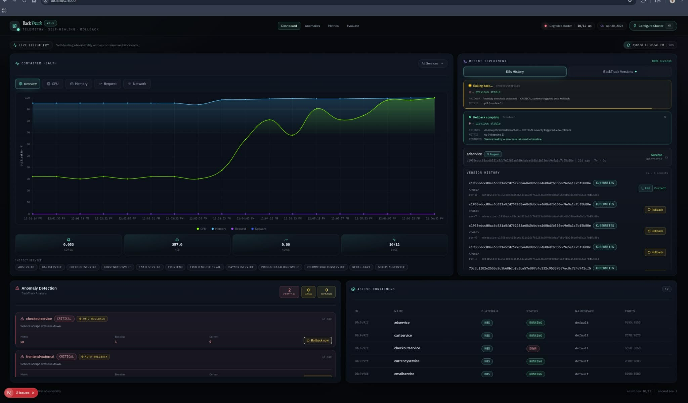
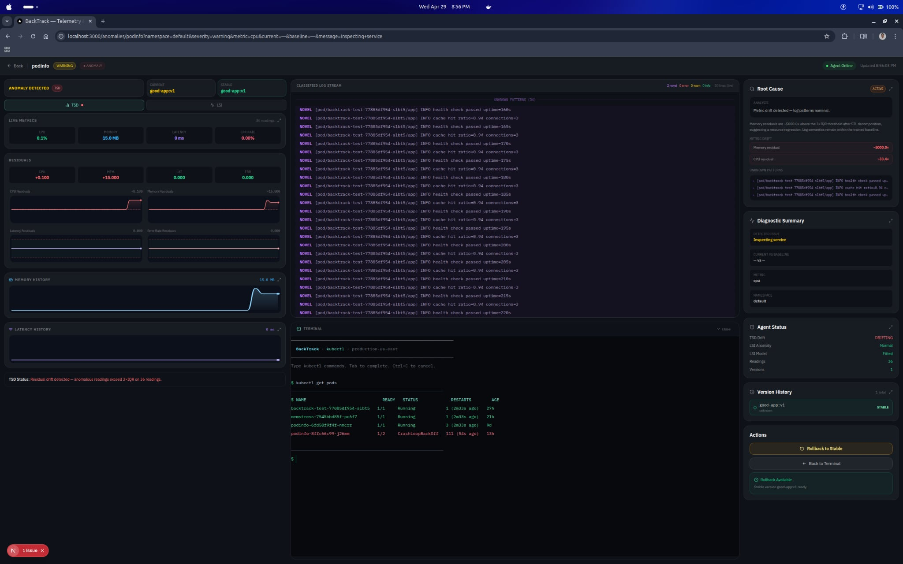
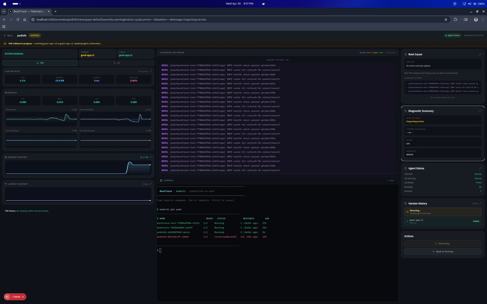
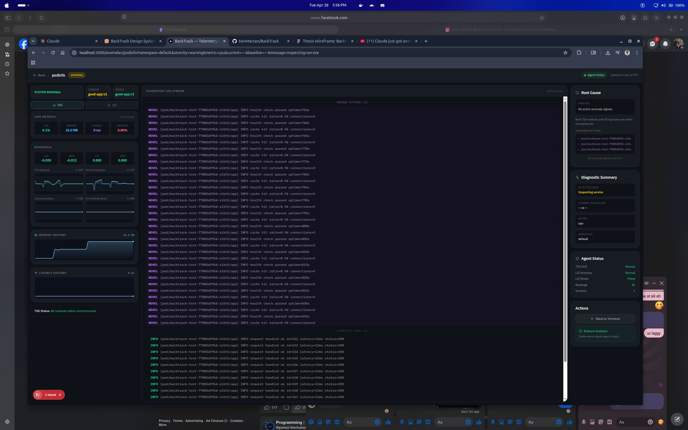

# BackTrack

> **Local-first observability, anomaly detection, and autonomous self-healing rollback for Kubernetes and Docker workloads.**

BackTrack watches your containerized services in real time, detects metric drift and log anomalies using two independent ML algorithms (TSD and LSI), and automatically rolls back to the last stable version when thresholds are breached — no cloud dependency, no SaaS, no agent phone-home.

---

## Screenshots

### Dashboard — Live Telemetry

> Container Health chart, Recent Deployments, Anomaly Detection panel, and Active Containers table.

### Anomalies — TSD + LSI Live Panels

> Anomalies page with the agent online. Interactive kubectl terminal, TSD Metrics, LSI Analysis.

### Anomalies — Full Live View

> TSD metrics update every 10 s. LSI score history chart fills as the corpus grows.

### Service Diagnostics — Per-Service Drill-Down

> TSD/LSI panels, classified log stream, root cause analysis, rollback action.

---

## What It Does

| Capability | Description |
|---|---|
| **Service Discovery** | Auto-discovers all pods/containers via `kubectl get deployments` or `docker ps` |
| **Per-Service Monitoring** | Individual TSD + LSI collectors per service |
| **Live Metrics** | Polls Prometheus for CPU, memory, request rate — falls back to `kubectl top` |
| **TSD** | STL decomposition → flags drift when residuals exceed 3×IQR for 3 consecutive readings |
| **LSI** | TF-IDF + SVD on live logs → classifies INFO/WARN/ERROR/NOVEL per 30-second window |
| **Confusion Matrix** | Live precision, recall, F1, accuracy for both TSD and LSI |
| **Auto-Rollback** | After 3 consecutive anomaly cycles (~90 s), rolls back to last STABLE snapshot |
| **Replica Restore** | Rollback restores replicas automatically if deployment was scaled to 0 |
| **NodePort Exposure** | After rollback, creates/patches a NodePort service for immediate access |
| **Kubectl Terminal** | Interactive terminal embedded in the Anomalies page |
| **Rollback History** | Full audit trail with MTTR tracking |

---

## Architecture

```
┌──────────────────────────────────────────────────────────┐
│                    BackTrack Dashboard                    │
│              Next.js 16 · React 19 · TypeScript           │
│                                                           │
│  /               → Dashboard (health, metrics, anomalies) │
│  /anomalies      → Terminal + TSD/LSI live panels         │
│  /anomalies/[s]  → Per-service diagnostics + rollback     │
│  /metrics        → MTTR + Confusion Matrix                │
└──────────────────┬──────────────────┬─────────────────────┘
                   │                  │
             kubectl/docker      HTTP :8847
                   │                  │
       ┌───────────▼────┐   ┌─────────▼───────────────┐
       │  Your Cluster  │   │   backtrack-agent        │
       │  or Docker     │   │   Python · FastAPI       │
       │  runtime       │   │                          │
       └────────────────┘   │  TSD collector (per svc) │
                            │  LSI log analyser (per)  │
                            │  Version snapshotter     │
                            │  Rollback executor       │
                            └──────────────────────────┘
```

**Ports:**

| Service | Port | Notes |
|---|---|---|
| backtrack-dashboard | `3847` | Next.js frontend |
| backtrack-agent | `8847` | FastAPI backend |

---

## Compatibility

| Your app is running as… | Supported? |
|---|---|
| Docker container | ✅ Yes |
| Kubernetes pod / deployment | ✅ Yes |
| Bare process / systemd / VM | ❌ Containerize it first |
| Serverless (Lambda, Cloud Run) | ❌ Out of scope |

---

## Getting Started

Choose the path that matches your setup:

- **[Docker Hub Quickstart](docs/DOCKER_HUB.md)** — Using pre-built images from Docker Hub (fastest, **no source code needed**)
- **[From Source](docs/SETUP.md)** — Building and running from this repo (development)
- **[Setup Guide](docs/SETUP.md)** — Full reference for all configurations

---

## 1. Docker Hub Quickstart

No Node, no Python. Just Docker and a `.env` file.

**Step 1 — Download the compose file and configure your target**

```bash
mkdir backtrack && cd backtrack
curl -O https://raw.githubusercontent.com/KenMarzan/BackTrack/main/docker-compose.yml
curl -o .env https://raw.githubusercontent.com/KenMarzan/BackTrack/main/.env.example
```

Edit the `.env` file in the same directory as `docker-compose.yml`:

```
# File: .env

BACKTRACK_TARGET=my-app        # Docker container name or K8s deployment name
BACKTRACK_IMAGE_TAG=latest     # Your current image tag
GITHUB_TOKEN=                  # Optional — for deployment history panel
```

**Step 2 — Start BackTrack**

```bash
# Run from the directory containing docker-compose.yml
docker compose up -d
```

**Step 3 — Connect your app**

1. Open **http://localhost:3847**
2. Click **Configure Cluster** (top-right)
3. Choose **Docker** or **Kubernetes**
4. Enter your container or deployment name → click **Connect**

---

## 2. From Source

**Prerequisites:** Node.js 20+, Python 3.10+, `kubectl` or Docker CLI

**Step 1 — Clone**

```bash
git clone https://github.com/KenMarzan/BackTrack.git
cd BackTrack
```

**Step 2 — Start the dashboard**

```bash
# Run from: backtrack-dashboard/
cd backtrack-dashboard
npm install
npm run dev
```

Dashboard available at **http://localhost:3847**

> `npm run dev` runs the Next.js dev server. For production use `npm run build && npm run start`.

**Step 3 — Start the agent**

```bash
# Run from: backtrack-agent/
cd backtrack-agent
python3 -m venv .venv
.venv/bin/pip install -r requirements.txt
```

**Docker mode:**

```bash
# Run from: backtrack-agent/
BACKTRACK_MODE=docker \
BACKTRACK_TARGET=<your-container-name> \
BACKTRACK_IMAGE_TAG=<current-tag> \
.venv/bin/uvicorn src.main:app --host 0.0.0.0 --port 8847
```

**Kubernetes mode:**

```bash
# Run from: backtrack-agent/
BACKTRACK_MODE=kubernetes \
BACKTRACK_K8S_NAMESPACE=<your-namespace> \
BACKTRACK_TARGET=<your-deployment-name> \
BACKTRACK_IMAGE_TAG=<current-tag> \
.venv/bin/uvicorn src.main:app --host 0.0.0.0 --port 8847
```

**Step 4 — Connect**

Open **http://localhost:3847** → click **Configure Cluster** → fill in the form → **Connect**.

---

## Kubernetes Mode

Kubernetes mode requires `kubectl` access from inside the containers. Mount your kubeconfig in both services.

Edit `docker-compose.yml` and uncomment the kubeconfig volume under both services:

```yaml
# File: docker-compose.yml

services:
  backtrack-dashboard:
    volumes:
      - /var/run/docker.sock:/var/run/docker.sock
      - backtrack-data:/.backtrack
      - ~/.kube:/root/.kube:ro     # ← uncomment this line

  backtrack-agent:
    volumes:
      - backtrack-data:/data
      - /var/run/docker.sock:/var/run/docker.sock
      - ~/.kube:/root/.kube:ro     # ← uncomment this line
```

Also set these in your `.env` file:

```
# File: .env

BACKTRACK_MODE=kubernetes
BACKTRACK_K8S_NAMESPACE=default    # your namespace
```

Then restart:

```bash
docker compose down && docker compose up -d
```

In the dashboard Connect modal:
- **Platform** → Kubernetes
- **Architecture** → Microservices (discovers all deployments in namespace)
- **Namespace** → your namespace

### Verify pods have the required label

BackTrack uses `app=<service-name>` as the pod label selector by default:

```bash
kubectl get pods -n default --show-labels | head -5
# Expected: app=frontend, app=checkoutservice, etc.
```

To override: set `BACKTRACK_K8S_LABEL_SELECTOR=<selector>` in `.env`.

---

## Docker Mode

No cluster configuration needed — only the container name.

1. Open **http://localhost:3847**
2. Click **Configure Cluster**
3. **Platform** → Docker
4. **Application name** → exact container name (check with `docker ps --format "{{.Names}}"`)
5. Click **Connect**

The Docker socket is already mounted in `docker-compose.yml` — no extra setup needed.

---

## Configuration Reference

### Agent — environment variables

Set these in `.env` (next to `docker-compose.yml`) or export before running uvicorn.

```
# File: .env

# ── Required ──────────────────────────────────────────────
BACKTRACK_TARGET=my-app          # Container name (Docker) or deployment name (K8s)
BACKTRACK_IMAGE_TAG=latest       # Current image tag for snapshot tracking

# ── Mode ──────────────────────────────────────────────────
BACKTRACK_MODE=                  # docker | kubernetes  (auto-detected if blank)
BACKTRACK_K8S_NAMESPACE=default  # K8s namespace to watch
BACKTRACK_K8S_LABEL_SELECTOR=    # Override pod label selector (e.g. app=myapp)

# ── Rollback ───────────────────────────────────────────────
BACKTRACK_ROLLBACK_ENABLED=true  # Set false to disable auto-rollback
BACKTRACK_ROLLBACK_COOLDOWN=120  # Seconds between consecutive rollbacks
BACKTRACK_STABLE_SECONDS=600     # Clean seconds before marking a version STABLE

# ── Scraping ───────────────────────────────────────────────
BACKTRACK_SCRAPE_INTERVAL=10     # Seconds between metric scrapes

# ── TSD sensitivity ────────────────────────────────────────
BACKTRACK_TSD_IQR_MULTIPLIER=3.0 # Lower = more sensitive

# ── LSI sensitivity ────────────────────────────────────────
BACKTRACK_LSI_SCORE_MULTIPLIER=2.0
BACKTRACK_SVD_SIMILARITY_THRESHOLD=0.55  # Raise to reduce false positives
BACKTRACK_CORPUS_SIZE=200        # Log lines before fitting the LSI model
BACKTRACK_BASELINE_WINDOWS=10    # Scoring windows before locking the LSI baseline
BACKTRACK_WINDOW_SECONDS=30      # LSI scoring window duration

# ── Storage ────────────────────────────────────────────────
BACKTRACK_DATA_DIR=/data         # Inside agent container
```

### Dashboard — `.env.local`

Create this file at `backtrack-dashboard/.env.local` when running from source:

```
# File: backtrack-dashboard/.env.local

BACKTRACK_AGENT_URL=http://127.0.0.1:8847   # URL of the running backtrack-agent
GITHUB_TOKEN=                                # Optional — GitHub PAT for deployment panel
BACKTRACK_MEMORY_THRESHOLD_MIB=120          # Memory anomaly threshold (MiB)
```

---

## How TSD Works

BackTrack collects CPU, memory, latency, and error rate every 10 seconds. Once 12 readings are available:

1. **STL decomposition** splits each series into **Seasonal** + **Trend** + **Residual**
2. **IQR envelope** computes 3×IQR on historical residuals as the drift boundary
3. **Drift flag** raised when the last 3 consecutive residuals all exceed 3×IQR
4. **Flat-zero detection** catches crashes where metrics drop to near-zero from a non-zero baseline

**Timing:**

| Milestone | Time after agent start |
|---|---|
| TSD begins collecting | Immediately |
| TSD ready for drift detection | ~2 min (12 readings × 10 s) |
| Version marked STABLE | 10 min clean operation |
| Auto-rollback triggers | 3 anomaly cycles (~90 s) |

---

## How LSI Works

BackTrack tails logs from each container/pod and processes them in 30-second windows:

1. **Corpus collection** — first 200 log lines build the training set
2. **TF-IDF vectorisation** of each line
3. **SVD** reduces to a latent semantic space; centroids built per class (INFO/WARN/ERROR)
4. **Keyword pre-check** — lines with error/warn keywords fast-pathed before SVD
5. **SVD classification** — cosine similarity > 0.55 threshold required (configurable)
6. **Anomaly score** = `(ERROR×3 + NOVEL×5 + WARN×1) / total` per window
7. **Rolling baseline** — baseline updates from non-anomalous windows, so it adapts over time

**Timing:**

| Milestone | Time after agent start |
|---|---|
| Log tailing starts | Immediately |
| Corpus filled (200 lines) | ~3 min for active services |
| Baseline locked | ~5 min after corpus fill |
| Anomaly detection active | After baseline locked |

---

## Rollback Flow

**Manual** (Dashboard → Recent Deployments → Rollback button):

1. BackTrack checks replica count — if 0, scales to 1 first
2. Executes `kubectl rollout undo deployment/<name>`
3. Waits for rollout to complete
4. Creates/patches a NodePort service so the app is immediately accessible
5. Returns the access URL in the success notification

**Automatic** (agent-triggered):

1. Agent detects 3 consecutive cycles where TSD drifting **or** LSI anomalous
2. Executes rollback + replica restore
3. 120 s cooldown prevents rollback loop

**Docker rollback** preserves original container configuration (ports, environment variables, volume mounts) from the stopped container before recreating it with the stable image tag.

---

## Pages

### Dashboard (`/`)
- **Container Health** — per-service CPU/memory charts, running/down/unknown status
- **Recent Deployments** — K8s rollout history, BackTrack version snapshots, one-click rollback
- **Anomaly Detection** — live anomaly list with severity chips, auto-rollback badge
- **Active Containers** — table of all discovered services

### Anomalies (`/anomalies`)
- **Terminal** — interactive kubectl terminal showing actual connected cluster name
- **TSD Metrics** — CPU/Memory/Latency/Error Rate with Seasonal · Trend · Residual sparklines
- **LSI Analysis** — score vs threshold, score history chart, classified log lines

### Service Diagnostics (`/anomalies/[service]`)
- Per-service TSD + LSI panels, classified log stream, root cause analysis, rollback action

### Evaluation Metrics (`/metrics`)
- **MTTR** — Mean Time to Recovery across all rollback events
- **Confusion Matrix** — live TSD + LSI precision/recall/F1/accuracy

---

## Troubleshooting

**Dashboard shows no services**

```bash
kubectl get pods -n default    # Verify pods are running
docker ps                      # Verify containers are up
```

**Agent offline**

```bash
curl http://127.0.0.1:8847/health    # Should return {"status":"ok"}
curl http://127.0.0.1:8847/services  # List monitored services
```

**All metrics are zero**

- Verify metrics-server is installed: `kubectl top pods -n default -l app=<service>`
- Check for port conflict: `ss -tlnp | grep 8847`

**LSI corpus stuck at 0 lines**

```bash
kubectl logs -n default -l app=<service> --tail=5   # Verify logs exist
curl http://127.0.0.1:8847/services                 # Check agent sees service
```

**TSD/LSI panels empty after connecting**

- Agent needs ~2 min for TSD, ~5 min for LSI to warm up
- Service name in Connect modal must exactly match the deployment/container name

**Rollback didn't restore the app**

- BackTrack auto-restores replicas if scaled to 0 before running `rollout undo`
- Check rollback history: `curl http://127.0.0.1:8847/rollback/history`

**K8s mode — kubectl finds no pods**

- Ensure kubeconfig is mounted: see [Kubernetes Mode](#kubernetes-mode)
- Verify pods have `app=<name>` labels: `kubectl get pods --show-labels`

**Agent name input doesn't match any container**

- When entering the app name in Connect modal, BackTrack falls back through tiers:
  1. Exact Docker Compose project name match
  2. Container name / image name contains input
  3. Partial project name match
- If nothing matches, the UI shows available container/service names as suggestions

**High LSI false positives**

```
# File: .env
BACKTRACK_SVD_SIMILARITY_THRESHOLD=0.70   # Raise from default 0.55
BACKTRACK_LSI_SCORE_MULTIPLIER=3.0        # Raise from default 2.0
```

**Too many TSD alerts**

```
# File: .env
BACKTRACK_TSD_IQR_MULTIPLIER=5.0   # Raise from default 3.0
```

---

## API Reference

### Dashboard Routes

| Method | Path | Description |
|---|---|---|
| `GET` | `/api/connections` | List all saved connections |
| `POST` | `/api/connections` | Test or create a connection |
| `GET` | `/api/dashboard/overview` | Aggregated service health + anomaly list |
| `GET` | `/api/deployments/history` | Rollout history from kubectl |
| `POST` | `/api/rollback` | Trigger rollback for a service |
| `GET` | `/api/agent?path=<endpoint>` | Proxy to backtrack-agent |
| `GET` | `/api/prometheus/query` | Proxy PromQL query with Bearer auth |
| `POST` | `/api/terminal` | Execute shell command |
| `GET` | `/api/metrics/mttr` | MTTR stats and history |
| `GET` | `/api/metrics/detection` | Confusion matrix + detection entries |

### Agent Endpoints (port 8847)

| Method | Path | Description |
|---|---|---|
| `GET` | `/health` | Agent status and monitored services |
| `GET` | `/services` | Per-service drift/anomaly flags |
| `GET` | `/metrics?service=<name>` | TSD metrics + decomposition + evaluation |
| `GET` | `/lsi?service=<name>` | LSI scores + classified logs + confusion matrix |
| `GET` | `/versions` | Version snapshots |
| `GET` | `/rollback/history` | Rollback event log |
| `POST` | `/rollback/trigger` | Manually trigger rollback |
| `POST` | `/reconfigure` | Hot-reload target/services without restart |

---

## Security Notes

BackTrack is designed for **local or internal operator use only**.

- `POST /api/terminal` executes arbitrary shell commands — do not expose publicly
- Connection tokens stored in `.backtrack/connections.json` (plain text)
- No authentication or RBAC by default

---

## License

MIT — see LICENSE file.
